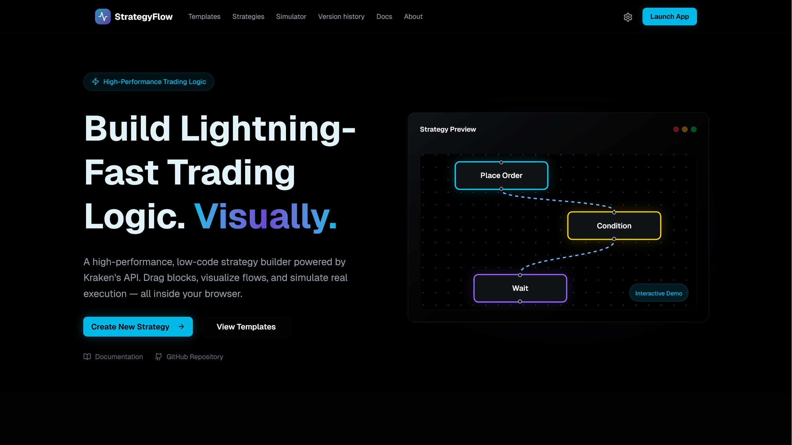
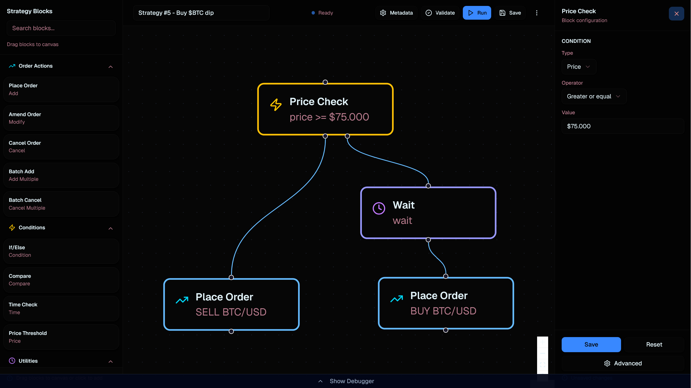
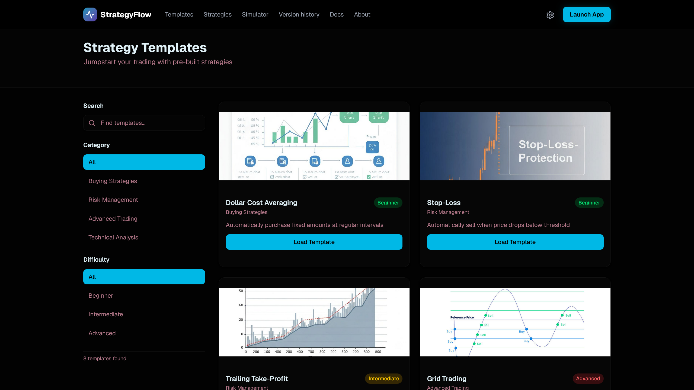
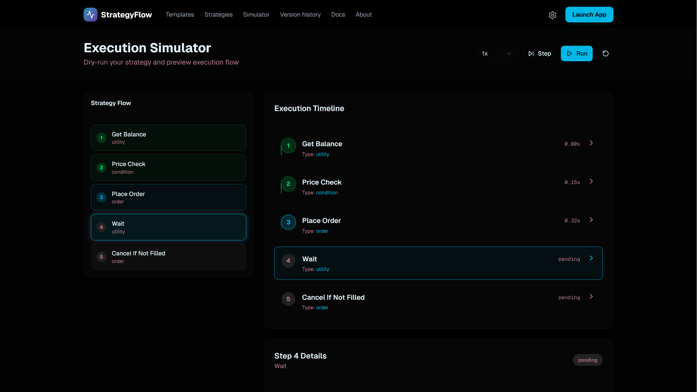
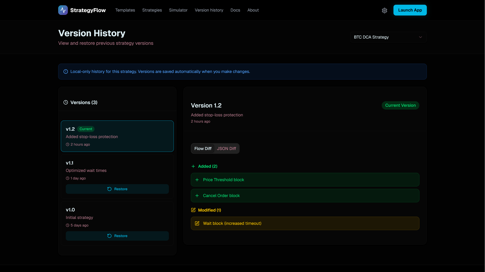

<p align="center">
  
</p>

<h1 align="center">StrategyFlow</h1>

<p align="center">
  <strong>A visual, low-code strategy builder for crypto trading powered by Kraken's API</strong>
</p>

<p align="center">
  <a href="https://strategyflow.dev/">Live Demo</a> •
  <a href="https://www.youtube.com/watch?v=nSUAowGQ5YM">Video Walkthrough</a> •
  <a href="docs/DOCUMENTATION.pdf">Documentation</a> •
  <a href="https://taikai.network/en/kraken/hackathons/kraken-forge/overview">Hackathon website</a>
</p>

<p align="center">
  
  
  
  
  
</p>

---

## Problem statement

Building automated trading strategies traditionally requires extensive programming knowledge, making it inaccessible to many traders. Even experienced developers face challenges with Kraken API authentication, order management complexity, and lack of visual feedback during strategy development. StrategyFlow bridges this gap by providing a drag-and-drop interface that generates production-ready API calls while offering real-time simulation and debugging capabilities.

---

## What I built

StrategyFlow is a high-performance, low-code strategy builder that enables traders to visually compose, simulate, and execute trading strategies using Kraken's API. Users drag modular blocks onto a canvas, connect them to define execution flow, configure parameters through an intuitive inspector panel, and deploy strategies directly to Kraken, all without writing code.

The application features a complete React Flow-based visual editor, real-time Kraken API integration with proper HMAC-SHA512 authentication, an execution simulator for dry-runs, a template gallery with pre-built strategies, and comprehensive export capabilities.

---

## Features

- **Drag & Drop strategy builder:** Visual node editor powered by React Flow with intuitive block connections
- **Full Kraken API integration:** Direct order execution with proper authentication (AddOrder, CancelOrder, BatchOrders, etc.)
- **Execution simulator:** Step-by-step dry-run with block highlighting and I/O inspection
- **Template gallery:** Pre-built strategies including DCA, Stop-Loss, Grid Trading, RSI Momentum, and more
- **Real-time inspector:** Configure block parameters with instant visual feedback
- **Flow debugger:** Inspect inputs, outputs, and errors during execution
- **Export system:** Export strategies as JSON definitions or TypeScript SDK skeletons
- **Version history:** Track strategy changes over time

---

## Technical highlights

**Technology stack:**
- **Front-end:** React 19.2, Next.js 16, TypeScript 5, React Flow for the visual editor
- **Styling:** Tailwind CSS 4, Radix UI components for accessible, polished UI
- **API layer:** Next.js API routes with HMAC-SHA512 signature generation using crypto-js
- **State management:** React hooks with useNodesState/useEdgesState for graph state

**Architecture decisions:**
- Modular component structure with separate node types (Order, Condition, Logic, Utility) for maintainability and extensibility
- Server-side API routes to securely handle Kraken credentials (keys never exposed to client)
- Type-safe block definitions with TypeScript discriminated unions for exhaustive pattern matching
- Clean separation between UI layer, strategy engine, and API wrapper for testability

**Performance optimizations:**
- React Flow's built-in virtualization for large strategy graphs
- Memoized node callbacks to prevent unnecessary re-renders
- Lazy-loaded pages with Next.js dynamic imports

---

## How it works

### Installation

```bash
# Clone the repository
git clone https://github.com/MauriceBoendermaker/kraken_forge_hackathon_2025.git
cd kraken_forge_hackathon_2025/front-end

# Install dependencies
npm install

# Configure environment variables
cp .env.example .env
# Add your Kraken API credentials to .env

# Start development server
npm run dev
```

### Environment variables

```env
KRAKEN_API_KEY=your_api_key
KRAKEN_PRIVATE_KEY=your_private_key
API_URL=https://api.kraken.com
```

### Basic usage

1. **Open the editor:** Navigate to `/editor` to access the visual strategy builder
2. **Add blocks:** Drag blocks from the sidebar (Order Actions, Conditions, Utilities, System)
3. **Connect nodes:** Click and drag between node handles to define execution flow
4. **Configure parameters:** Select a node and use the Inspector panel to set values
5. **Test strategy:** Use the Simulator (`/simulator`) to dry-run before live execution
6. **Execute:** Click "Run Strategy" to execute against Kraken's API

### Workflow example

```
┌─────────────┐     ┌──────────────┐     ┌──────────────┐
│ Get Balance │───▶│ Price Check   │───▶│ Place Order  │
└─────────────┘     │  (> $45,000) │     │ (0.1 BTC)    │
                    └──────────────┘     └──────────────┘
```

---

## Demo & Documentation

| Resource | Link |
|----------|------|
| Live demo | [https://strategyflow.dev/](https://strategyflow.dev/) |
| Video walkthrough | [YouTube - PLACEHOLDER](https://www.youtube.com/watch?v=nSUAowGQ5YM) |
| Full documentation | [docs/DOCUMENTATION.pdf](docs/DOCUMENTATION.pdf) |

> **Note:** The live demo connects to a Kraken Pro account without funded balance for safety. Order executions will return "Insufficient funds" as expected - this confirms the API integration is working correctly.

---

## Screenshots

*Screenshots demonstrating key features of StrategyFlow*

| Landing page                                   | Strategy editor                         |
|------------------------------------------------|-----------------------------------------|
|  |  |

| Template gallery                              | Execution simulator                           |
|-----------------------------------------------|-----------------------------------------------|
|  |  |

| Version history                                           | Saved trading strategies                                |
|-----------------------------------------------------------|---------------------------------------------------------|
|  |  |

---

## Project structure

```
front-end/
├── api/                      # Client-side API utilities
│   ├── add_order.ts          # AddOrder wrapper
│   ├── cancel_order.ts       # CancelOrder wrapper
│   ├── execute_orderblock.ts # Node execution dispatcher
│   └── ...
├── app/
│   ├── api/                  # Server-side API routes (secure)
│   │   ├── add-order/        # POST /api/add-order
│   │   ├── cancel-order/     # POST /api/cancel-order
│   │   └── api-signer.ts     # HMAC-SHA512 signature generator
│   ├── editor/               # Main strategy builder page
│   ├── simulator/            # Execution simulator page
│   ├── templates/            # Template gallery page
│   └── ...
├── components/
│   ├── strategy-builder/     # Core editor components
│   │   ├── strategy-builder.tsx
│   │   ├── sidebar.tsx
│   │   ├── inspector.tsx
│   │   ├── toolbar.tsx
│   │   └── nodes/            # Custom React Flow nodes
│   └── ui/                   # Reusable UI components (Radix-based)
├── constants/                # Block categories, node type definitions
├── interfaces/               # TypeScript interfaces
├── lib/                      # Utilities and templates
└── types/                    # Type definitions for nodes
```

---

## Future enhancements

- **OpenAI integration:** Natural language strategy creation ("Create a DCA strategy for BTC every Monday") that auto-generates visual blocks
- **WebSocket real-time data:** Live orderbook and ticker feeds within the editor
- **Backtesting engine:** Historical data simulation with performance metrics
- **Strategy marketplace:** Share and discover community-built strategies

---

## Integration notes

This project is designed for easy integration into existing trading platforms:

- **Modular components:** Each component (Sidebar, Inspector, Toolbar) can be imported independently
- **Standalone landing page:** The demo landing page (`/`) can be removed or replaced in production
- **Configurable theming:** Dark theme, easily customizable via Tailwind CSS
- **No backend required:** API routes run within Next.js; deploy as a single application

---

## Author

**Maurice Boendermaker**  
Submission for Kraken Forge Hackathon 2025 (Track #3: Strategy Builder)

---

## License

This project is licensed under the MIT License. See [LICENSE](./LICENSE) for details.

```
SPDX-License-Identifier: MIT
```
